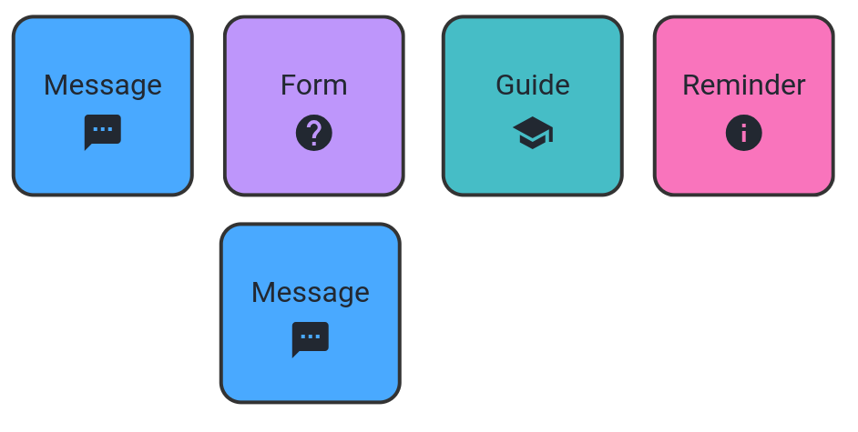

# Nursing Basic Components (NBCs)

| **Category**                          | **NBCs\***                                                                                              | **Total** |
|---------------------------------------|--------------------------------------------------------------------------------------------------------|---------|
| Clinical Care and Procedures          | Critical patient, Tracheal care, Drainage, Neurological assessment, Therapy, Fetal care, Equipment, Bowel, Blood, Safety, Tube ventilation | 11      |
| Medication and Treatment Management   | Medication control, Pain control, Sedation, Injection, Glucose / insulin control, Allergy, Vaccination, Laboratory tests, Fluid control | 9       |
| Mental Health and Well-being          | Emotion tracker, Anxiety control, Emotional support, Anger management, Suicide risk, Meditation       | 6       |
| Vital Signs Monitoring and Control    | Vital Signs, Temperature control, Measurement tracker, Electrolyte, Capillarity                        | 5       |
| Planning and Routine Management       | Reminder, Scheduling, Task, Goal, Progress                                                             | 5       |
| Social and Behavioral Well-being      | Social, Behavior tracker, Smoking cessation, Abuse, Religion                                          | 5       |
| Entertainment and Motivation          | Gaming, Reward, Hobby, Makeup                                                                          | 4       |
| Hygiene and Physical Health           | Oral hygiene, Skin, Feet control, Eye care                                                             | 4       |
| Communication and Shared Care         | Shared care, HCP contact, Message, Audio recording                                                    | 4       |
| Nutrition and Eating Habits           | Nutrition, Hydration, Fluid control, Weight control                                                   | 4       |
| Education and Health Guides           | Guide, Resources, Form                                                                                | 3       |
| Physical Activities and Mobility      | Exercise, Breathing control, Stimulation                                                              | 3       |
| Symptoms and Diagnosis                | Symptom Checker, Symptoms Tracker                                                                     | 2       |
| Rest and Sleep                        | Sleep control, Fatigue                                                                                | 2       |

## Figures

    
    <em style="margin-top: 20px">Figure 1. Methodology overview.</em>

## Care plan example

Nurses play a critical role in providing close care and monitoring for patients, even after discharge from the hospital. They are often responsible for the follow-up care that ensures continuity in health management and prevents complications. Studies have shown that nurses frequently coordinate and deliver post-discharge care, especially in high-risk patients. This includes both in-person and remote interactions, such as telehealth, to maintain communication with patients and ensure their health is monitored closely during recovery at home.

The nursing process is a structured, patient-centered approach that guides nurses in providing effective and efficient care. Its cyclical and adaptable nature supports clinical reasoning and judgment, allowing nurses to meet patient needs in a constantly evolving healthcare environment (see Figure below). Based on the American Nurses Association (ANA) Standards of Professional Nursing Practice, this process defines the core actions and competencies expected of all registered nurses, regardless of their role, specialty, or setting.

The nursing process involves five essential steps as described in Figure 2:

    
    <em style="margin-top: 20px">Figure 2. The Nursing Process. Adapted from Ernstmeyer 2021</em>

1. **Assessment**  
   This is the initial stage where nurses gather comprehensive information about the patient’s physical, emotional, and psychological health. This data is collected through patient interviews, observations, physical examinations, and reviewing medical histories. The assessment provides a baseline for further care planning.

2. **Diagnosis**  
   After assessment, nurses analyze the data to identify the patient’s problems or potential health risks. These diagnoses are not medical diagnoses but nursing diagnoses, which describe the patient's response to health conditions. Examples include "ineffective airway clearance" or "risk for infection."

3. **Planning**  
   In this stage, nurses set measurable and achievable short- and long-term goals for the patient's care. Based on the diagnosis, nurses develop a personalized care plan with interventions designed to address the patient’s needs. This plan involves setting priorities and determining the expected outcomes.

4. **Implementation**  
   The nurse puts the care plan into action by performing interventions designed to address the patient’s problems. This could include administering medication, providing education, or assisting with activities of daily living. Nurses continuously assess and modify interventions based on the patient’s response.

5. **Evaluation**  
   The final step involves evaluating the effectiveness of the care plan. Nurses assess whether the goals were met and determine if any modifications are necessary. If the outcomes are not achieved, the nurse revisits the process, adjusting the plan to meet the patient's needs better.

A care plan can be structured using a standardized language, called NANDA-NIC-NOC (NNN). The NNN taxonomy enables nurses to create a clear, standardized, and evidence-based care plan that links diagnosis (NANDA), interventions (NIC), and outcomes (NOC).

North American Nursing Diagnosis Association International (NANDA-I, previously called NANDA) is a global nursing association that standardizes nursing diagnoses. A diagnosis is a clinical judgment about individual, family, or community experiences and responses to actual or potential health problems and life processes. NANDA-I focuses on defining standardized nursing diagnoses—statements that describe a patient’s response to health conditions or life processes. In practice, it defines a standard and controlled vocabulary that can be used in different health settings. In a nursing care plan, the assessment phase leads to identifying a NANDA-I diagnosis. For instance, a nurse might identify "Impaired physical mobility" or "Risk for infection" as the diagnosis.

The Nursing Interventions Classification (NIC) standardizes nursing interventions. Once a diagnosis is made, the NIC taxonomy provides a list of standardized nursing interventions that are evidence-based actions to address the diagnosis. Interventions can be independent or collaborative, direct or indirect, and individual or group oriented. In the planning and implementation phases of the nursing care plan, nurses select appropriate interventions from NIC. In our example, for "Impaired physical mobility," the nurse may choose interventions like "Exercise therapy" or "Fall prevention".

Finally, the Nursing Outcomes Classification (NOC) taxonomy offers standardized outcomes used to evaluate the success of nursing interventions. Nurses set measurable goals that are directly linked to these outcomes, which are assessed during the evaluation phase of the nursing care plan. Following our example, for "Impaired physical mobility," the expected outcome might be "Improved walking ability" or "Reduced fall risk".

The implementation phase of a care plan is critical for translating planned interventions into actions to achieve the desired health outcomes. During this phase, effective communication between the nurse and the patient is essential to ensure the patient understands their illness, treatment, and the specific interventions being carried out. Good communication fosters patient engagement, promotes treatment adherence, and helps reduce anxiety by clarifying any uncertainties. A thorough understanding of their condition empowers patients to take an active role in their care, improving compliance and overall outcomes. The NIC taxonomy plays a significant role in this phase by providing a standardized set of interventions that nurses can explain clearly to patients. By using the precise, evidence-based language of NIC, nurses can ensure that patients grasp the rationale behind each action, fostering transparency and trust. Moreover, the taxonomy allows for personalized care while maintaining consistency across different healthcare providers, ensuring the patient receives a well-coordinated and understandable care experience.

An mHealth app can significantly enhance the implementation of a care plan by providing a platform for ongoing communication, monitoring, and support between healthcare providers and patients. For this reason, we assume the care plan as the main line of reasoning and the NIC taxonomy as the domain language used by HCPs.

### NIC structure

The NIC taxonomy was first published in 1992 and is hierarchically organized into 7 domains, 30 classes, more than 500 interventions, and 12,000 actions or activities (hereafter, called activities). Figure 2 presents the current domains and classes of the NIC taxonomy, and Figure 3 shows an example of one intervention and its breakdown into activities.

    
    <em style="margin-top: 20px">Figure 3. NIC taxonomy composed by domains (1st level), classes (2nd level), interventions (3rd level), and actions (4th level)</em>

    
    <em style="margin-top: 20px">Example of activities associated to the "fluid monitoring" intervention.</em>

Nurses often need to tailor interventions to align with specific patient conditions, preferences, and cultural factors, which makes a standardized approach challenging. Therefore, activities associated with each intervention are not standardized because every patient has unique needs, health statuses, and personal circumstances. In this work, we refer to activities as defined in the NIC reference book. One can classify the activities into two groups: nurse-dependent and nurse-independent. The first one includes actions that require nurse participation (for example, catheter replacement). The second group contains actions that the patient can do on their own (for example "drinking water every 2 hours"). In this work, we focus on the second group.

### Running example

Let us consider one example to illustrate the nursing process using NNN taxonomy. We have John, a 55-year-old male patient diagnosed with urolithiasis (kidney stones). The nursing process is applied using the NNN framework as follows:

1. **Assessment**  
   John presents with symptoms of flank pain, nausea, and hematuria (blood in urine). He has a history of recurring kidney stones, often linked to inadequate hydration and dietary habits. The nurse gathers data about his fluid intake, dietary choices, and his understanding of urolithiasis prevention. The following data is collected:

   - Blood glucose logs  
   - Dietary assessment  
   - Pain level reports  
   - Urine characteristics  

2. **Diagnosis**  
   Using the NANDA-I framework, the nurse identifies the primary nursing diagnosis:  
   *Risk for Imbalanced Fluid Volume related to insufficient knowledge of fluid intake requirements, as evidenced by frequent episodes of kidney stones.*

3. **Planning**  
   The nurse collaborates with John to set achievable goals for managing his urolithiasis. The plan focuses on adequate hydration and adherence to a prescribed diet low in oxalates. The following NOCs (outcomes) are selected:

   - Adequate fluid balance  
   - Improved knowledge of fluid intake requirements  
   - Adherence to dietary modifications  

4. **Implementation**  
   The interventions focus on activities that John can perform independently. The following NICs are selected:

   - **Health Education**  
     - Develop educational materials written at a readability level appropriate to the target audience  
     - Formulate objectives for a health education program  
     - Emphasize the importance of healthy patterns of eating, sleeping, exercising, etc. to individuals, families, and groups who model these values and behaviors to others, particularly children  

   - **Fluid Monitoring**  
     - Monitor weight  
     - Determine if the patient is experiencing thirst or symptoms of fluid changes (e.g., dizziness, change of mentation, lightheadedness, apprehension, irritability, nausea, twitching)  

   - **Teaching: Prescribed Diet**  
     - Include the family, as appropriate  
     - Inform the patient of possible drug and food interactions, as appropriate  
     - Appraise the patient’s current level of knowledge about the prescribed diet  

   For each selected NIC, the nurse needs to tailor the interventions to John's lifestyle and communicate possible daily actions that can help him overcome his health problem. This includes, for instance, advising John to log his meals and water intake volume, administering specific medication for pain, or recommending a particular podcast about weight control, considering John's preference for this type of media.

   At this point, an mHealth app can be useful to document the nurse’s instructions to John and help him implement them throughout his day during the treatment period.

5. **Evaluation**  
   A return appointment is scheduled for six weeks from now so the nurse can evaluate John’s progress. The goal is for him to increase his daily water intake and follow the recommended dietary guidelines. As a result, the nurse expects a decrease in symptoms, and his urine characteristics indicate better hydration.

## Composing NBCs into a care plan
We demonstrate how the devised NBCs can be composed into a care plan implementation by using the two case studies mentioned before: cancer and urolithiasis. For each one, we represent one intervention using the devised NBCs. 

Figure 4 shows the representation of the "exercise promotion" intervention. In that, the care plan orients the patient on the importance of exercising, collects exercise history, and, depending on the patient's response, suggests sharing his/her exercises to improve engagement. Also, we explain the importance of exercising and, finally, we remind the patient about his/her daily exercises. This simple example already shows the need for a computational model to support the instantiation of the devised NBCs. Such a model is beyond the scope of this paper. We are currently assuming a composition based on a data-flow model, but this definition requires further research and validation with HPCs. For now, we aim to validate whether the information derived from the interventions and patient-tailored actions, which need to be communicated to the patient, can be represented by the defined NBCs.

    
    <em style="margin-top: 20px">Figure 4. NBCs used for ``exercise promotion" intervention. Note that connected nodes indicate a logic dependency flow between two nodes. Unconnected nodes can be executed independently.</em>

Figure 5 represents the actions derived from the ``fluid monitoring" intervention. We first recommend a medication to avoid ingesting more than the recommended fluid quantity (medication control element) and also remind the patient about the foods he/she should avoid (reminder element). When the medication is taken by the patient, we ask the patient about his/her intake and output in the last 24 hours (quiz element). Finally, when it is answered, we have two possible options: the answer indicates whether the patient's intake and output are as expected or not. If so, we send an orientation congratulating the patient and informing them of the benefits of his/her effort (orientation element). On the other hand, if the answer indicates the opposite, we orient the patient to talk to the responsible HCP (orientation element) along with taking a specific medication (medication element). Again, one notices the feasibility of describing the actions present in the care plan and the need to express the dependency between some actions. 

    
    <em style="margin-top: 20px">Figure 5. BCs used for "fluid monitoring" intervention.</em>

Based on these results, we conclude that common behaviors present in distinct care plans can indeed be modeled as reusable NBCs. Furthermore, the NBCs can describe patient-tailored healthcare actions and be combined into adaptable clinical workflows, aiding the implementation phase of nursing care plans.  
